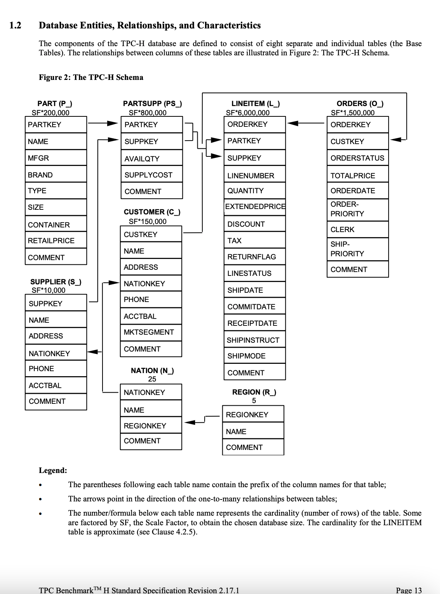

- [Advanced Data Transformation in SQL Workshop](#advanced-data-transformation-in-sql-workshop)
  - [Live virtual workshop](#live-virtual-workshop)
  - [Prerequisites](#prerequisites)
  - [Setup](#setup)
    - [Github codespaces setup](#github-codespaces-setup)
    - [Local environment setup](#local-environment-setup)
  - [Data Model](#data-model)
  - [Topics covered in the workshop](#topics-covered-in-the-workshop)
  - [Feedback](#feedback)

# Advanced Data Transformation in SQL Workshop

## Live virtual workshop

The workshop was streamed on YouTube live: [Advanced Data Processing in SQL YouTub Live](https://youtube.com/live/fB4XHC6ZaCs). It should be available to watch and follow at your own pace.

## Prerequisites

1. Go through the [Setup](#setup) process and complete the **[0-basics](./0-basics.ipynb)** notebook exercises.

## Setup

### Github codespaces setup

To set this up on github codespaces as is suggested in the workshop follow [these](https://github.com/josephmachado/adv_data_transformation_in_sql?tab=readme-ov-file#option-1-github-codespaces-recommended) instructions.
### Local environment setup

Steps:

1. Clone this repo, cd into the cloned repo
2. Start a virtual env and install requirements.
3. In the terminal run `python setup.py` to create the tables and data necessary for the exercises.
4. Start Jupyter lab and run the `ipynb` notebooks.
5. Complete the **[0-basics](./0-basics.ipynb)** notebook as prerequisite.

```bash
git clone https://github.com/josephmachado/adv_data_transformation_in_sql.git
cd adv_data_transformation_in_sql
python -m venv ./.venv # create a virtual env
source .venv/bin/activate # use virtual environment
pip install -r requirements.txt
python setup.py
jupyter lab
```

## Data Model

The TPC-H data represents a car parts seller’s data warehouse, where we record orders, items that make up that order (lineitem), supplier, customer, part (parts sold), region, nation, and partsupp (parts supplier). 

Note: Have a copy of the data model as you follow along; this will help in understanding the examples provided and in answering exercise questions.



## Topics covered in the workshop

1. [Window functions](./concepts/windows/)
2. [CTEs](./concepts/CTE/)
3. [Common query templates for common data processing problems](./concepts/query_templates/)

## Feedback

I'd love to hear any feedback, please send them **[by clicking here](https://jrir55dxz0v.typeform.com/to/FH21xsvY)**.
